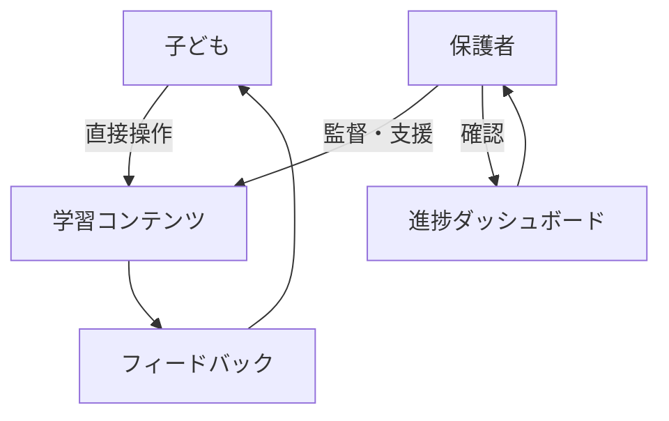
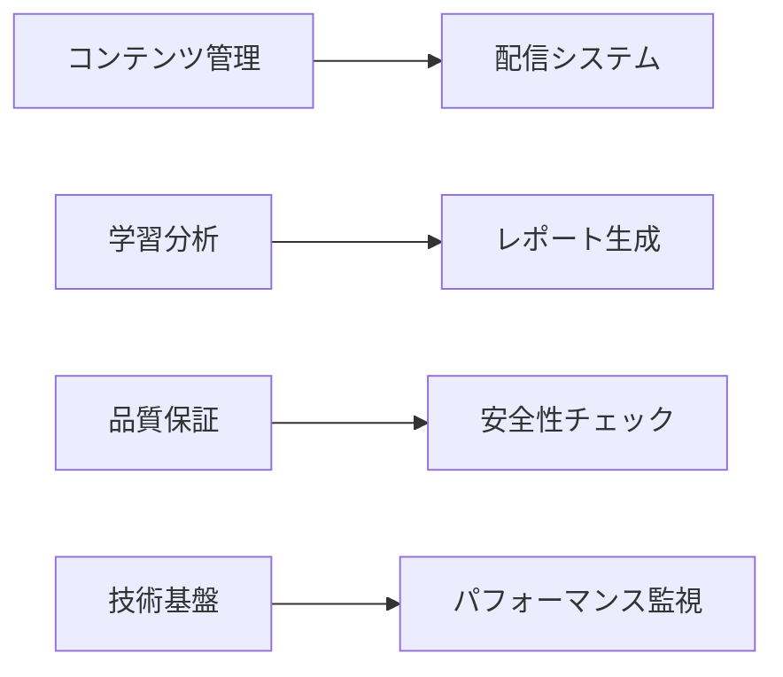
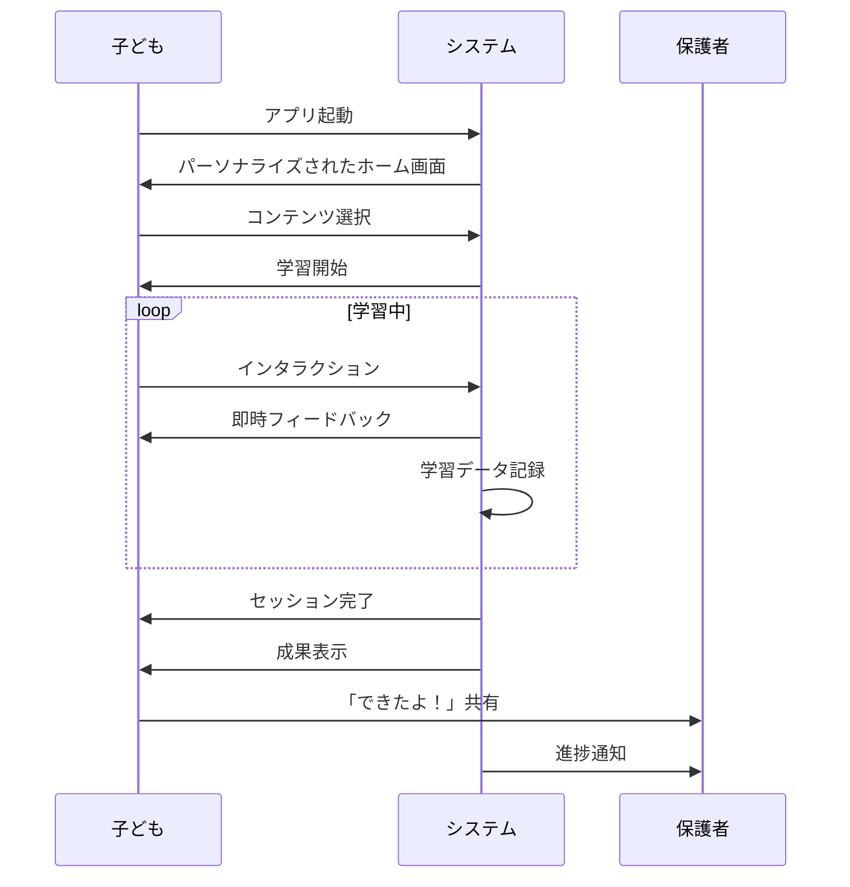
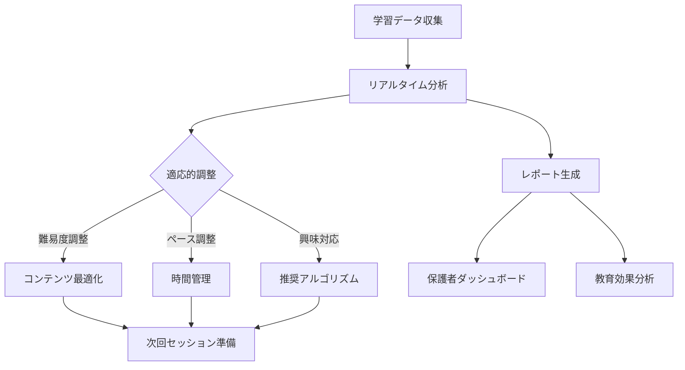

# MyFir サービス設計ブループリント

## 🎯 サービス概要

MyFirは、3-6歳児とその保護者を対象とした、安全で教育的なデジタル学習プラットフォームです。「初めて」の体験を通じて、子どもたちが自信を持ってデジタル世界に踏み出せるよう支援します。

## 🏗️ サービスアーキテクチャ

### フロントステージ（ユーザー接点）



### バックステージ（内部プロセス）



## 📍 サービスタッチポイント詳細

### 1. 認知・発見段階

#### オンラインタッチポイント
- **検索エンジン**
  - SEO最適化されたランディングページ
  - 「子ども パソコン 学習」「3歳 デジタル教育」等のキーワード
  - 教育的価値を訴求するメタデータ

- **SNS・コミュニティ**
  - 育児系インフルエンサーとの連携
  - ママ向けFacebookグループでの口コミ
  - 教育系Twitterでの情報発信

- **教育メディア**
  - 育児雑誌のWeb版での紹介
  - 教育系ブログでのレビュー
  - YouTube育児チャンネルでの紹介

#### オフラインタッチポイント
- **保育園・幼稚園**
  - 保護者会での紹介資料配布
  - 先生向けワークショップ
  - デモ体験会の実施

- **公共施設**
  - 図書館でのデジタル教育イベント
  - 児童館でのワークショップ
  - 子育て支援センターでの展示

### 2. 検討・評価段階

#### デジタルタッチポイント
- **公式サイト**
  - 保護者向け詳細説明ページ
  - 安全性・プライバシーポリシー明示
  - 教育効果のエビデンス提示
  - 利用者の声・事例紹介

- **無料体験**
  - 登録不要の即時体験
  - 代表的なコンテンツの一部公開
  - 保護者向けガイド付き

#### 信頼構築要素
- **第三者認証**
  - 教育機関からの推薦
  - 児童発達専門家の監修証明
  - プライバシーマーク取得

- **透明性**
  - 開発チーム紹介
  - 教育理念の明示
  - 更新履歴の公開

### 3. 利用開始段階

#### オンボーディングフロー

```
1. ウェルカム画面
   └─ 親子で一緒に見る想定
   └─ 3ステップの簡単説明

2. 年齢選択
   └─ 3歳 / 4歳 / 5歳 / 6歳
   └─ 発達段階に応じた初期設定

3. 興味選択（任意）
   └─ 好きなもの（動物、乗り物、など）
   └─ パーソナライズの基礎データ

4. 保護者設定
   └─ 利用時間の設定
   └─ 通知設定
   └─ プライバシー設定

5. チュートリアル
   └─ 基本操作の練習
   └─ 親子で楽しめる設計
```

### 4. 継続利用段階

#### エンゲージメント設計

**日次利用サイクル**
```
起動
 ↓
今日の学習提案（パーソナライズ）
 ↓
学習セッション（15-20分）
 ↓
成果の確認（バッジ、スタンプ）
 ↓
保護者への共有提案
```

**週次利用サイクル**
```
週間目標設定（月曜）
 ↓
日々の学習記録
 ↓
週末レビュー（達成度確認）
 ↓
次週への動機付け
```

**月次利用サイクル**
```
月間レポート生成
 ↓
成長の可視化
 ↓
新しい学習領域の提案
 ↓
保護者フィードバック収集
```

### 5. 推奨・拡散段階

#### アドボケイト化施策
- **共有機能**
  - 子どもの作品共有（プライバシー配慮）
  - 成長記録のSNS投稿
  - 招待特典プログラム

- **コミュニティ形成**
  - 保護者向けフォーラム
  - 月例オンラインイベント
  - 地域別ユーザーミートアップ

## 🔄 サービスプロセスフロー

### 学習セッションフロー



### バックエンドプロセス



## 👥 ステークホルダーマップ

### 直接的ステークホルダー

#### 1. 子ども（3-6歳）
- **役割**: 主要ユーザー
- **ニーズ**: 楽しい体験、成功体験、承認
- **提供価値**: 学習機会、スキル習得、自信構築

#### 2. 保護者
- **役割**: 意思決定者、サポーター
- **ニーズ**: 安全性、教育効果、利便性
- **提供価値**: 安心感、成長可視化、時間効率

#### 3. 教育関係者
- **役割**: 推奨者、利用促進者
- **ニーズ**: 教育カリキュラムとの整合性
- **提供価値**: 補助教材、評価ツール

### 間接的ステークホルダー

#### 4. 開発チーム
- **役割**: サービス提供者
- **責任**: 品質保証、継続改善
- **KPI**: ユーザー満足度、技術的安定性

#### 5. コンテンツ制作者
- **役割**: 教育コンテンツ開発
- **責任**: 教育的価値、エンゲージメント
- **KPI**: 完了率、学習効果

#### 6. 専門家アドバイザー
- **役割**: 監修、助言
- **分野**: 児童発達、教育心理、デジタル安全
- **貢献**: 科学的根拠、信頼性向上

## 📊 サービス品質指標

### ユーザー体験指標

| 指標 | 目標値 | 測定方法 |
|-----|--------|----------|
| 初回完了率 | >80% | チュートリアル完了数/開始数 |
| 継続率（7日） | >60% | 7日後アクティブ数/登録数 |
| セッション時間 | 15-20分 | 平均利用時間 |
| 完了率 | >85% | ステージ完了数/開始数 |
| 満足度 | >4.5/5 | 定期アンケート |

### 教育効果指標

| 指標 | 目標値 | 測定方法 |
|-----|--------|----------|
| スキル習得率 | >90% | 評価テスト合格率 |
| 知識定着率 | >70% | 1週間後の再テスト |
| 応用力 | >60% | 新規課題への適応率 |
| 自信向上 | >80% | 自己評価アンケート |

### 技術品質指標

| 指標 | 目標値 | 測定方法 |
|-----|--------|----------|
| 稼働率 | >99.9% | システム監視 |
| 応答速度 | <100ms | パフォーマンス測定 |
| エラー率 | <0.1% | エラーログ分析 |
| 読み込み時間 | <2秒 | Core Web Vitals |

## 🛡️ リスク管理とミティゲーション

### 主要リスクと対策

#### 1. 安全性リスク
- **リスク**: 不適切コンテンツの混入
- **対策**: 
  - 多段階レビュープロセス
  - 自動コンテンツフィルタリング
  - ユーザー報告システム

#### 2. プライバシーリスク
- **リスク**: 子どもの個人情報漏洩
- **対策**:
  - データ最小化原則
  - 暗号化通信
  - 定期的セキュリティ監査

#### 3. 依存性リスク
- **リスク**: 過度のスクリーンタイム
- **対策**:
  - 利用時間制限機能
  - 休憩リマインダー
  - オフライン活動の提案

#### 4. 技術的リスク
- **リスク**: システム障害
- **対策**:
  - 冗長性設計
  - 定期バックアップ
  - 障害時の代替プラン

## 🚀 将来の拡張性

### 短期拡張計画（6ヶ月）
1. **コンテンツ拡充**
   - キーボード学習モジュール
   - 創造的表現ツール
   - 協調学習機能

2. **機能強化**
   - AI個別最適化
   - 音声ガイダンス
   - 多言語対応

### 中期拡張計画（1年）
1. **プラットフォーム拡張**
   - モバイルアプリ版
   - オフライン学習モード
   - 家庭学習連携

2. **エコシステム構築**
   - 教育機関向けAPI
   - サードパーティコンテンツ
   - 認定プログラム

### 長期ビジョン（2-3年）
1. **グローバル展開**
   - 多言語・多文化対応
   - 各国教育基準準拠
   - 国際コラボレーション

2. **次世代技術統合**
   - AR/VR学習体験
   - AIチューター
   - ブロックチェーン認証

---

*このサービス設計ブループリントは、ユーザーフィードバックと市場動向に基づいて定期的に更新されます。*

**作成日**: 2025年7月1日  
**作成者**: MyFir サービスデザイン統合分析チーム